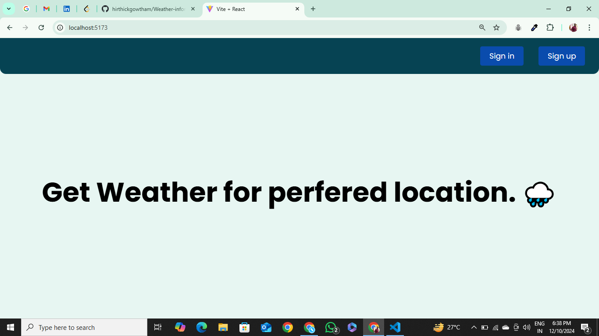

# **Weather Info Site**

## **Features**

### **Authentication**
- For authentication, I am using a **JWT (JSON Web Token)**.
- I am using cookies for authenticity validation.

### **Backend**
- Built with **Node.js** and **Express.js**.

### **Frontend**
- Developed using **React.js**.

### **Database**
- Utilized **PostgreSQL** to handle structured data.

---

## **Preview Images**

Here are the screenshots of the project:

  
.png)  
.png)  
.png)  
.png)  
.png)  
.png)
